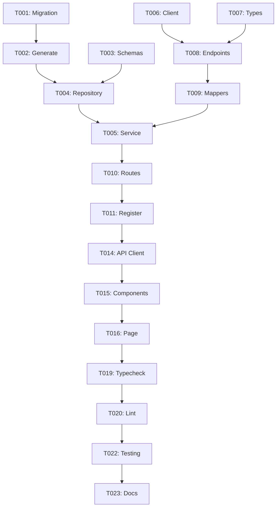

# Tasks Template

> Decomposição de tarefas para implementação. Gerar após plan aprovado.
> Referência: specs/[###-feature]/plan.md

---

## Metadata

| Campo | Valor |
|-------|-------|
| **Feature** | [###-feature-name] |
| **Plan** | [link para plan.md] |
| **Branch** | [###-feature-name] |
| **Data** | [PREENCHER] |

---

## Legenda

| Símbolo | Significado |
|---------|-------------|
| `[P]` | Pode executar em paralelo com outras [P] |
| `[S]` | Sequencial — depende de tasks anteriores |
| `[B]` | Blocker — outras tasks dependem desta |
| `✅` | Completa |
| `🔄` | Em progresso |
| `⏸️` | Bloqueada |
| `⬜` | Pendente |

---

## Fase 1: Infrastructure / Setup

| ID | Task | Tipo | Status | Arquivos |
|----|------|------|--------|----------|
| T001 | [B] Criar migration Prisma | Backend | ⬜ | `prisma/migrations/` |
| T002 | [S] Gerar Prisma client | Backend | ⬜ | — |
| T003 | [P] Adicionar Zod schemas | Types | ⬜ | `packages/types/src/` |

### T001: Criar migration Prisma
```bash
pnpm --filter api prisma migrate dev --name [feature-name]
```
**Verificação**: Migration aplicada sem erros

### T002: Gerar Prisma client
```bash
pnpm --filter api prisma generate
```
**Verificação**: Types atualizados

### T003: Adicionar Zod schemas
**Arquivo**: `packages/types/src/[feature].ts`
```typescript
// Schemas necessários
export const FeatureInputSchema = z.object({ ... });
export const FeatureOutputSchema = z.object({ ... });
```
**Verificação**: `pnpm typecheck` passa

---

## Fase 2: Backend — Repository Layer

| ID | Task | Tipo | Status | Arquivos |
|----|------|------|--------|----------|
| T004 | [P] Criar repository | Backend | ⬜ | `modules/[feature]/repository.ts` |

### T004: Criar repository
**Arquivo**: `apps/api/src/modules/[feature]/repository.ts`

Implementar:
- [ ] `create(data)` — Insert
- [ ] `findById(id)` — Select by ID
- [ ] `findMany(filters)` — Select com filtros
- [ ] `update(id, data)` — Update
- [ ] `delete(id)` — Soft/hard delete

**Verificação**: Queries funcionam no Prisma Studio

---

## Fase 3: Backend — Service Layer

| ID | Task | Tipo | Status | Arquivos |
|----|------|------|--------|----------|
| T005 | [S] Criar service | Backend | ⬜ | `modules/[feature]/service.ts` |

### T005: Criar service
**Arquivo**: `apps/api/src/modules/[feature]/service.ts`

Implementar:
- [ ] Lógica de negócio principal
- [ ] Validações de domínio
- [ ] Chamadas ao repository
- [ ] Chamadas a integrations (se necessário)

**Verificação**: Lógica de negócio correta

---

## Fase 4: Backend — Integration Layer (se aplicável)

| ID | Task | Tipo | Status | Arquivos |
|----|------|------|--------|----------|
| T006 | [P] Criar client | Backend | ⬜ | `integrations/[service]/client.ts` |
| T007 | [P] Criar types | Backend | ⬜ | `integrations/[service]/types.ts` |
| T008 | [S] Criar endpoints | Backend | ⬜ | `integrations/[service]/endpoints.ts` |
| T009 | [S] Criar mappers | Backend | ⬜ | `integrations/[service]/mappers.ts` |

### T006: Criar client
- [ ] Configurar axios/fetch
- [ ] Configurar auth headers
- [ ] Configurar rate limiting (p-limit)
- [ ] Configurar Redis cache

### T007: Criar types
- [ ] Types raw da API externa
- [ ] Response types

### T008: Criar endpoints
- [ ] Funções para cada endpoint
- [ ] Cache wrapper em cada chamada

### T009: Criar mappers
- [ ] Funções de transformação
- [ ] External → Internal models

**Verificação**: Chamadas à API externa funcionam

---

## Fase 5: Backend — Route Layer

| ID | Task | Tipo | Status | Arquivos |
|----|------|------|--------|----------|
| T010 | [S] Criar routes | Backend | ⬜ | `modules/[feature]/route.ts` |
| T011 | [S] Registrar plugin | Backend | ⬜ | `app.ts` |

### T010: Criar routes
**Arquivo**: `apps/api/src/modules/[feature]/route.ts`

Implementar:
- [ ] `GET /endpoint` — List/Read
- [ ] `POST /endpoint` — Create
- [ ] `PUT /endpoint/:id` — Update
- [ ] `DELETE /endpoint/:id` — Delete
- [ ] Auth guards (preHandler)
- [ ] Zod validation (schema)

### T011: Registrar plugin
```typescript
// app.ts
app.register(featureRoutes, { prefix: '/feature' });
```

**Verificação**: Endpoints respondem via curl/Postman

---

## Fase 6: Backend — Jobs (se aplicável)

| ID | Task | Tipo | Status | Arquivos |
|----|------|------|--------|----------|
| T012 | [P] Criar job | Backend | ⬜ | `jobs/[feature].job.ts` |
| T013 | [S] Registrar queue | Backend | ⬜ | `jobs/queues.ts` |

### T012: Criar job
- [ ] Processor function
- [ ] Error handling + Sentry
- [ ] SyncLog tracking

### T013: Registrar queue
- [ ] Adicionar ao scheduler (se cron)
- [ ] Adicionar trigger manual (se event)

**Verificação**: Job executa e loga corretamente

---

## Fase 7: Frontend — API Client

| ID | Task | Tipo | Status | Arquivos |
|----|------|------|--------|----------|
| T014 | [P] Criar API methods | Frontend | ⬜ | `lib/api/[feature].ts` |

### T014: Criar API methods
**Arquivo**: `apps/web/src/lib/api/[feature].ts`

Implementar:
- [ ] Typed fetch functions
- [ ] Error handling
- [ ] Response parsing

**Verificação**: Chamadas ao backend funcionam

---

## Fase 8: Frontend — Components

| ID | Task | Tipo | Status | Arquivos |
|----|------|------|--------|----------|
| T015 | [P] Criar componentes | Frontend | ⬜ | `components/[feature]/` |

### T015: Criar componentes
Para cada componente:
- [ ] Component implementation
- [ ] Props types
- [ ] Loading state
- [ ] Error state
- [ ] Empty state

**Verificação**: Componentes renderizam corretamente

---

## Fase 9: Frontend — Pages

| ID | Task | Tipo | Status | Arquivos |
|----|------|------|--------|----------|
| T016 | [S] Criar page | Frontend | ⬜ | `app/[route]/page.tsx` |
| T017 | [P] Criar loading | Frontend | ⬜ | `app/[route]/loading.tsx` |
| T018 | [P] Criar error | Frontend | ⬜ | `app/[route]/error.tsx` |

### T016: Criar page
- [ ] Data fetching
- [ ] Layout
- [ ] Components integration

### T017-18: Loading/Error states
- [ ] Skeleton loading
- [ ] Error boundary com retry

**Verificação**: Página funciona end-to-end

---

## Fase 10: Quality Assurance

| ID | Task | Tipo | Status | Arquivos |
|----|------|------|--------|----------|
| T019 | [S] Typecheck | QA | ⬜ | — |
| T020 | [S] Lint | QA | ⬜ | — |
| T021 | [P] Testes (se aplicável) | QA | ⬜ | `__tests__/` |
| T022 | [S] Manual testing | QA | ⬜ | — |

### T019: Typecheck
```bash
pnpm typecheck
# Must pass with 0 errors
```

### T020: Lint
```bash
pnpm lint
# Must pass with 0 warnings
```

### T021: Testes
- [ ] Unit tests
- [ ] Integration tests

### T022: Manual testing
- [ ] Happy path
- [ ] Edge cases
- [ ] Error scenarios

---

## Fase 11: Documentation

| ID | Task | Tipo | Status | Arquivos |
|----|------|------|--------|----------|
| T023 | [P] Atualizar CLAUDE.md | Docs | ⬜ | `CLAUDE.md` |
| T024 | [P] Atualizar env examples | Docs | ⬜ | `.env.example` |

### T023: Atualizar CLAUDE.md
- [ ] Marcar feature como COMPLETE
- [ ] Adicionar novas env vars
- [ ] Atualizar seção de models/routes

### T024: Atualizar env examples
- [ ] apps/api/.env.example
- [ ] apps/web/.env.local.example

---

## Resumo de Dependências



---

## Commit Strategy

Cada task completa = 1 commit

**Template de commit**:
```
feat([feature]): T0XX - [descrição curta]

- [detalhe 1]
- [detalhe 2]

Refs: #[issue-number]
```

---

## Definition of Done (por task)

- [ ] Código implementado
- [ ] Types corretos
- [ ] Sem `any`
- [ ] Sem `console.log`
- [ ] Error handling
- [ ] Verificação manual OK
